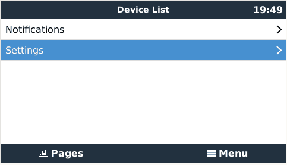

# TailscaleGX

This package is a user interface for tailscale on Victron Energy GX devices.

tailscale provides is a VPN-like connection for virtually any device.

Victron VRM provides access to the GX device's GUI,
but not a command line interface to the GX devie.
TailscaleGX provides an ssh connection and also http access to all the GUIs available on the GX device
Any web browser or ssh tool (ssh, scp, rsync, etc.) can be used to communicate with the GX device.
However a tailscale account is required and the tailscale app must be installed on the computer,
tablet or smart phone connecting to the GX device.

The GX device must also be logged in to the SAME tailscale account.

tailscale clients are available for Windows, Mac OS, iOS, Linux and Android.

TailscaleGX is on GitHub at https://github.com/mr-manuel/venus-os_TailscaleGX

And more information is available at:

https://tailscale.com

TailscaleReadMe.md file is also included in this package.

# Preview



# Install

## Execute commands via SSH

```bash
curl -s https://raw.githubusercontent.com/mr-manuel/venus-os_TailscaleGX/main/download-and-install.sh | bash
```

# Using

ssh access must be enabled in Settings / General, and a root password set
or any ssh tool will not be able to access the GX device.
To do this refer to:

https://www.victronenergy.com/live/ccgx:root_access

After installing TailscaleGX,
navigate to __Settings / General / Remote access via tailscale__

and turn on __Allow remote connections__

After tailscale starts up you will be presented a message reading and a QR code:

>__connect this GX devices to your account at:__

>__https://login.tailscale.com/x/xxxxxxxxxxxxx__

On a computer, tablet or smart phone with the tailscale app installed,
enter the URL exactly as it is shown on the screen or scan the QR code with a mobile device.

You will be asked login to your tailscale account.

Press the __Connect__ button.

On the GX devive, the message should change to:

>__accepting remote connections at:__

>__xxx.xxx.xxx.xxx__

>__xxxx:xxxx:xxxx::xxxx:xxxx__

(IPv4 and IPv6 addresses)

You can then connect to the GX device from any computer, etc logged in to your tailscale account.

Any tool for ssh, scp, etc or any web browser should work,
however you must have the tailscale app enabled and logged in to your account.

You can disable tailscale by turning __Allow remote connections__ off.
Turning it on again you will reconnect to tailscale without logging in again.
The same IP addresses will be used until you logout the GX device.

If you wish to disconnect the GX device from the existing tailscale account,
press the __Logout__ button. You can then log into a different account.

# Installing

TailscaleGX can be installed from Package manager.

In __Inactive packages__

If TailscaleGX is already in the list, select it and tap __Proceed__

If not in the list, select __new__ and fill in the details:

Packagename: venus-os_TailscaleGX

GitHub user: md-manuel

GitHub branch or tag: main

then tap __Proceed__

# Security

Only a computer, tablet or smart phone running the tailscale app
AND logged into the same account used when connecting the GX device
to tailscale can access the GX device.

There is information on the tailscale web site that discusses the security issues.

The GX device will not allow tailscale connections
when __Allow remote connections__ is turned off.

## Deny GX device traffic to the Tailscale network

To deny traffic from the GX device to the Tailscale network login into your [Tailscale](https://login.tailscale.com) account.

Go to `Access controls` and replace the current content with this (if you did not already made changes) and then save:

```json
{
	// Define the tags which can be applied to devices and by which users.
    // If a tag is assigned to a device, then it replaces the owner/user of the device.
    // This allows to restrict access for devices where a tag is assigned.
	// "tagOwners": {
	//  	"tag:example": ["autogroup:admin"],
	// },
	"tagOwners": {
		"tag:gx-devices": [],
	},

	// Define access control lists for users, groups, autogroups, tags,
	// Tailscale IP addresses, and subnet ranges.
	"acls": [
        // Allow access for any user who is a direct member (including all invited users) of the tailnet. Does not include users from shared nodes.
		// You can also make a more granular rule, see https://tailscale.com/kb/1337/acl-syntax#autogroups-autogroup
		{
			"action": "accept",
			"src":    ["autogroup:member"],
			"dst":    ["*:*"],
		},
	],

	// Define users and devices that can use Tailscale SSH.
	"ssh": [
		// Allow all users to SSH into their own devices in check mode.
		// Comment this section out if you want to define specific restrictions.
		{
			"action": "check",
			"src":    ["autogroup:member"],
			"dst":    ["autogroup:self"],
			"users":  ["autogroup:nonroot", "root"],
		},
	],
}
```

Go to the machines -> click on the three dots on the right of a machine name -> click on `Edit ACL tags...` -> select the `tag:gx-devices` and save.

Now this device can be accessed from the Tailscale network, but the device cannot access the Tailscale network.

# TailscaleGX details

The tailscale included in TailscaleGX is an "extra-small" build of v1.64.2.
This build is about 25 MB compared to about 50 MB for the pre-built binairies.

tailscale runs as a daemon (tailscaled).

In Venus OS, tailscaled is run as a daemontools service: __TailscaleGX-backend__

In addition a command-line application (tailscale) controls tailscaled.

The daemon only runs when __Allow remote connections__ is turned on.

A second service __TailscaleGX-control__:

- starts and stops TailscaleGX-backend
- manages bringing up the GX to tailscale server link
- collects login and connection status from tailscale
- provides this status to the GUI
- prompts the user for necessary steps to establish a connection
